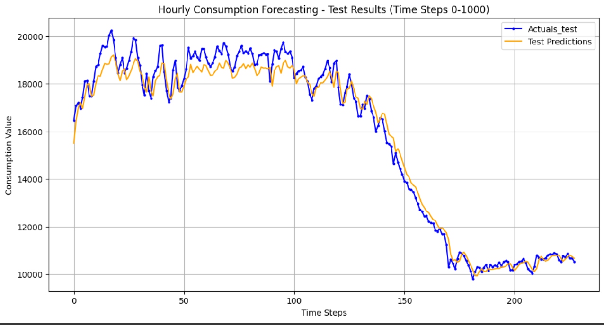

# 🧪 Pakistan_Energy_Demand(CNN/Sacked LSTM)
****
Harnessing CNN and Stacked LSTM models, our initiative focuses on predicting Pakistan's energy demand
*****

## **🌍 Detection_Process**
1. Data Preprocessing
2. Train/Test split
3. Model Training
4. Model validation
5. Model Testing

*****
CNN-LSTM



## 🌐 How to run?
### STEPS:

Clone the repository

```bash
https://github.com/AleemAhmedKhan/CNN_solar_panel_detection.git
```
### 💽  STEP 01- Create a conda environment after opening the repository
    
```bash
conda create -n news python=3.8 -y
```

```bash
conda activate news
```


###  🔍 STEP 02- install the requirements
```bash
pip install -r requirements.txt
```


```bash
# Finally run the following command
1. Models/01_Pak_Energy_EDA.ipynb
2. Models/02_Pak_Energy_Stacked_LSTM.ipynb
3. Models/03_Pak_Energy_CNN_LSTM.ipynb
4. Models/04_Data_Preprocessing_Train.ipynb

```

Now,
```bash
open up you local host and port
```


## 📡 CICD-Deployment-with-Github-Actions

## 🛠 Deployment Steps:

1. Build the Docker image of the Source Code
2. Push the Docker image to Container Registry
3. Launch the Web App Server in Azure 
4. Pull the Docker image from the container registry to Web App server and run 
